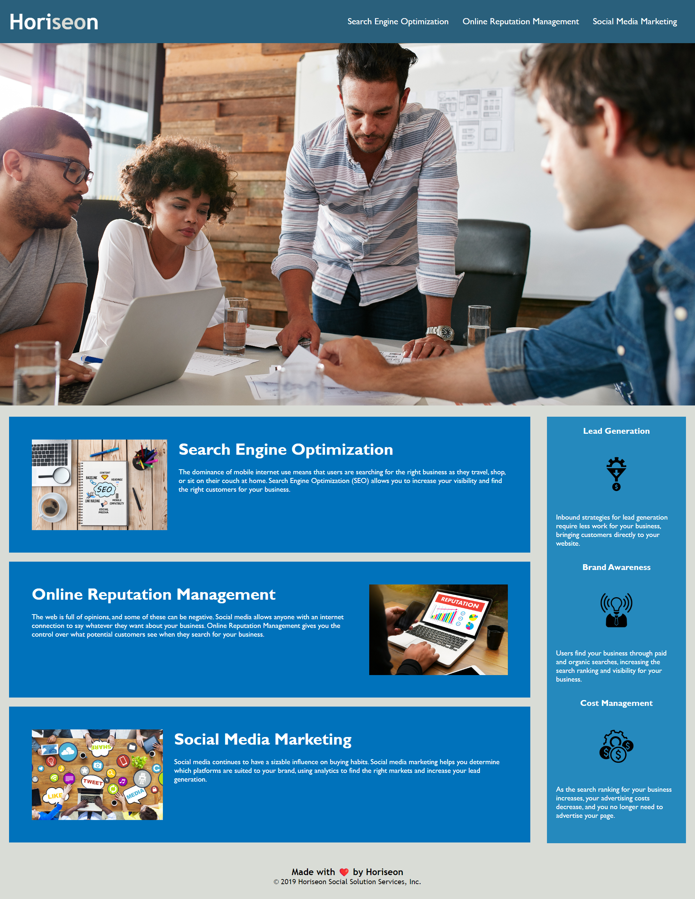

# JOB-TICKET1

## Technology Used 

| Technology Used         | Resource URL           | 
| ------------- |:-------------:| 
| HTML| [https://developer.mozilla.org/en-US/docs/Web/HTML](https://developer.mozilla.org/en-US/docs/Web/HTML) | 
| CSS | [https://developer.mozilla.org/en-US/docs/Web/CSS](https://developer.mozilla.org/en-US/docs/Web/CSS)    |   
| Git | [https://git-scm.com/](https://git-scm.com/)     |    

## Description 

As a coding consultant I was contracted by Horiseon to refractor their existing website so that it is more accessible to throughs with disabilities. Also, to make HTML more semantic and easier for other coders to utilize. I was motivated to help Horiseon make their website more streamlined. This solve the problem with accessibility for people with disabilities and streamlines the HTML and CSS code. 

[Visit the Deployed Site](https://ssherp.github.io/job-ticket1/)

## Usage 
This page is to help Horiseon customer understand what to do to improve company profiles by using Search Engine Optimization, Online Reputation Management, Social Media Marketing   

## Learning Points
On this job ticket, i was able to learn how to reorganize HTML and CSS to make it more user friendly without changing the front end of the website.

## Sonam Sherpa
[Linkedin](https://www.linkedin.com/in/sonam-sherpa-306559280)

* [Linkedin](https://www.linkedin.com/in/sonam-sherpa-306559280)
* [Github](https://github.com/ssherp/)

